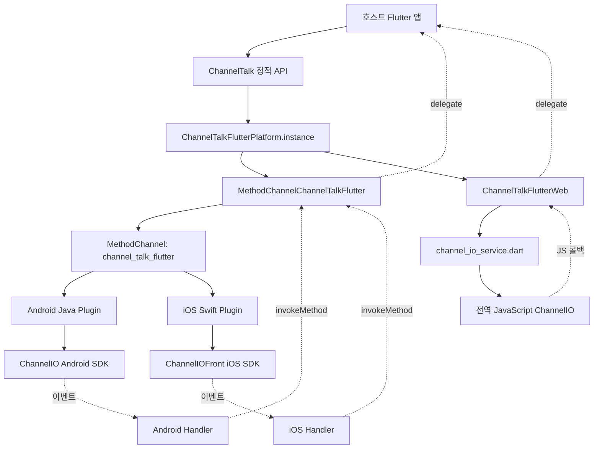

# 프로젝트 구조와 플랫폼 계약

기준일: 2026-09-12. 원격 변경을 통합한 작업 트리의 소스와 설정을 읽고 기록했다.
이 문서의 버전은 저장소 설정값이며 최신 배포 버전이라는 보장은 아니다.
구조 변경 시 관련 절을 갱신한다. 실행·검증 방법은 [TESTING.md](TESTING.md)에 있다.

## 1. 프로젝트 경계

`channel_talk_flutter`는 Channel.io SDK의 비공식 Flutter 래퍼다.
공개 Dart API와 플랫폼 인터페이스를 두고, 모바일은 MethodChannel,
웹은 JavaScript interop으로 SDK에 연결한다. 모든 구현은 한 pub 패키지에 들어 있다.
별도의 백엔드, 데이터베이스, 상태 관리 계층, Freezed 모델·코드 생성 과정은 없다.

`example/`는 로컬 패키지를 `path: ../`로 참조하는 수동 API 실행 앱이다.
플러그인 자체에는 Flutter UI가 없으며 상담 UI는 각 Channel.io SDK가 제공한다.

## 2. 파일 지도

```text
channel_talk_flutter/
├── AGENTS.md                         작업 규칙과 진입점
├── pubspec.yaml                      버전·의존성·플랫폼 등록
├── analysis_options.yaml             flutter_lints 설정
├── .flutter-version                  개발용 Flutter 버전 표기
├── lib/
│   ├── channel_talk_flutter.dart      ChannelTalk 정적 API, 언어·테마·boot 상태 enum
│   ├── channel_talk_flutter_platform_interface.dart
│   │                                 플랫폼 계약, delegate, 이벤트 enum
│   ├── channel_talk_flutter_method_channel.dart
│   │                                 모바일 요청·이벤트 변환
│   ├── channel_talk_flutter_web.dart   웹 변환·비동기 완료·리스너 상태
│   └── web/channel_io_service.dart    전역 ChannelIO 함수의 JS 선언
├── android/
│   ├── build.gradle                  SDK·컴파일 설정·JUnit·Mockito
│   └── src/
│       ├── main/AndroidManifest.xml   빈 manifest, 푸시 서비스 자동 등록 없음
│       ├── main/java/com/kuku/channel_talk_flutter/
│       │   ├── ChannelTalkFlutterPlugin.java
│       │   ├── ChannelTalkFlutterHandler.java
│       │   └── PushInterceptService.java
│       └── test/java/com/kuku/channel_talk_flutter/
│           └── ChannelTalkFlutterPluginTest.java
├── ios/
│   ├── channel_talk_flutter.podspec   CocoaPods 의존성·공유 소스·privacy 번들
│   └── channel_talk_flutter/
│       ├── Package.swift             SPM 의존성·공유 소스·privacy 리소스
│       └── Sources/channel_talk_flutter/
│           ├── ChannelTalkFlutterPlugin.swift
│           ├── ChannelTalkFlutterHandler.swift
│           └── PrivacyInfo.xcprivacy
├── macos/                            getPlatformVersion 템플릿
├── test/                             Dart VM·Chrome 브라우저 테스트
├── example/
│   ├── lib/main.dart                 JSON 입력·API 버튼·결과 표시
│   ├── android/                      Android 빌드 호스트
│   ├── ios/                          iOS 초기화·빌드 호스트
│   ├── macos/                        macOS 템플릿 호스트
│   ├── web/index.html                Channel.io 스크립트 로더
│   └── test/widget_test.dart          이전 템플릿 테스트
└── docs/                             구조·테스트·SDK 점검 기록
```

`build/`, `.dart_tool/`, `Pods/`, `.symlinks/`, Gradle 캐시와 생성된 플러그인 등록 코드는
실행 환경 산출물이다. `.codegraph/`는 코드 탐색 인덱스이며 런타임 의존성이 아니다.
저장소에 `.github/workflows/` CI 설정은 없다.

## 3. 요청과 이벤트 흐름



플랫폼 선택은 `ChannelTalk`에서 OS를 검사하는 방식이 아니다.
`ChannelTalkFlutterPlatform.instance`의 초기값이 MethodChannel 구현이며,
웹 등록 함수 `ChannelTalkFlutterWeb.registerWith`가 이를 웹 구현으로 교체한다.
setter는 `PlatformInterface.verifyToken`으로 구현의 토큰을 검증한다.
테스트는 `MockPlatformInterfaceMixin`을 사용한 가짜 구현으로 교체하고 원상 복구한다.

`ChannelTalk`는 공개 인자를 Map으로 변환하거나 플랫폼 구현에 위임한다.
별도의 모델 계층은 없으며 `Language.value`는 `en`, `ko`, `ja`, `device`,
`Appearance.value`는 `system`, `light`, `dark`다.
`ChannelTalkBootStatus`도 공개 API 파일에 선언되며 `bootWithStatus`의 상세 결과를 나타낸다.
이벤트 enum과 delegate typedef는 플랫폼 인터페이스 파일에 선언되어 있다.
메인 API 파일이 이 타입들을 export하지 않으므로 명시적으로 참조하려면 해당 파일도 import한다.

### 채널 계약

모바일 요청과 네이티브 이벤트는 동일한 `channel_talk_flutter` MethodChannel을 사용한다.
EventChannel이나 Pigeon 생성 코드는 없다.

| 요청 | Dart → 네이티브 인자 |
| --- | --- |
| `boot`, `bootWithStatus` | 공유 `_buildBootConfig`에서 구성한 설정 Map 그대로 |
| `openChat` | `chatId`, `message`; 생략값도 null 키로 포함 |
| `track` | `eventName`, 지정한 경우에만 `properties` |
| `updateUser` | 공개 API에서 구성한 부분 업데이트 Map 그대로 |
| `initPushToken` | `deviceToken` |
| 푸시 판별·수신·저장 | `content` 안에 푸시 Map |
| `setDebugMode` | `flag` |
| `setPage` | `page`는 null이어도 포함, `profile`은 지정 시 포함 |
| `addTags`, `removeTags` | `tags` |
| `openWorkflow` | `workflowId`; 생략 시 null |
| `setAppearance` | `appearance` 문자열 |
| `setPreventDefaultUrlClick` | `prevent` |

`sleep`, `shutdown`, 버튼·메신저 표시/숨김, `hidePopup`, `resetPage`,
`isBooted`, 저장 푸시 조회·열기는 인자 없이 호출한다.
`setListener`·`removeListener`는 Dart 수신 핸들러를 관리하며 같은 이름의 네이티브 요청은 없다.
`bootForWeb`도 별도의 채널 메서드가 아니라 플랫폼의 `boot(config)`로 연결된다.

## 4. 플랫폼별 구현 범위

아래의 지원은 현재 브리지에 구현되어 있다는 뜻이다. 계정·권한·기기 준비까지 보장하지 않는다.

| 기능 | Android | iOS | Web |
| --- | --- | --- | --- |
| `boot`, `shutdown` | 구현 | 구현 | 구현 |
| `bootWithStatus` | 상세 상태 enum | 상세 상태 enum | success 또는 unknown |
| `bootForWeb` | 웹 전용 옵션 무시 | 웹 전용 옵션 무시 | 전용 옵션 적용 |
| `sleep`, `isBooted`, `setDebugMode` | 구현 | 구현 | 미구현 |
| 버튼·메신저·채팅·팝업·워크플로·테마 | 구현 | 구현 | 구현 |
| `track`, `updateUser`, 태그 추가·삭제 | 구현 | 구현 | 구현 |
| `setPage`, `resetPage` | 구현 | 구현 | setPage만 page 필수 |
| 토큰 등록·푸시 판별·수신 | 구현 | 구현 | 미구현 |
| `storePushNotification` | `UNAVAILABLE` 오류 | 구현 | 미구현 |
| 저장 푸시 조회·열기 | Activity 필요 | 구현 | 미구현 |
| 리스너 등록·해제, URL 차단 설정 | 구현 | 구현 | 구현 |
| `onPushNotificationClicked` 이벤트 | 구현 | 미구현 | 미구현 |

웹 미구현 기능은 플랫폼 인터페이스의 기본 메서드에 도달해 `UnimplementedError`를 발생시킨다.
macOS는 모든 Channel Talk 기능이 미구현이다. 네이티브의 `getPlatformVersion`만 존재하며
이를 호출하는 공개 `ChannelTalk` API도 없다. Windows·Linux 플랫폼 등록은 없다.

### 반환값과 오류

대부분의 공개 API는 `Future<bool?>`지만 플랫폼별 성공·실패 의미는 같지 않다.

| 작업 | Android | iOS | Web |
| --- | --- | --- | --- |
| boot 실패 콜백 | `PlatformException` | `false` | `false` |
| boot 성공 판단 | SUCCESS와 user 존재 | success와 user 존재 | error 없음 |
| bootWithStatus 콜백 결과 | 상세 상태 enum | 상세 상태 enum | error 없으면 success, 있으면 unknown |
| updateUser 오류 콜백 | `PlatformException` | `PlatformException` | `false` |
| updateUser 오류 없음 | user 존재 여부 | user 존재 여부 | `true` |
| 태그 작업 콜백 | 오류면 예외, 아니면 user 존재 여부 | user 존재 여부 | error 없음 여부 |
| 단순 표시·설정 명령 | 호출 뒤 `true` | 호출 뒤 `true` | 호출 뒤 `true` |

단순 명령의 `true`는 UI 표시나 서버 작업이 완료되었음을 확인한 결과가 아니다.
웹의 콜백 기반 API 내부에서 JS 호출이 예외를 던지면 Future 오류로 전달된다.
다른 웹 메서드는 JS를 직접 호출하므로 모든 예외가 같은 방식으로 비동기 포장되지는 않는다.
모바일은 Flutter 오류 envelope를 MethodChannel에서 `PlatformException`으로 전달한다.
Android 오류 코드는 주로 `UNAVAILABLE`, `ERROR`, `INITIALIZATION_FAILED`이며,
iOS 인자·SDK 오류 코드는 주로 호출 메서드명이다.

`bootWithStatus`는 `Future<ChannelTalkBootStatus>`를 반환한다. 네이티브 브리지가 보내는
`success`, `notInitialized`, `networkTimeout`, `notAvailableVersion`,
`serviceUnderConstruction`, `requirePayment`, `accessDenied`, `unknown` 문자열을
MethodChannel 구현에서 같은 이름의 enum으로 변환한다. null이나 미지의 문자열은 `unknown`이다.
Android·iOS 모두 SDK 성공 상태와 user 존재를 함께 확인하며, user가 없으면 `unknown`을
반환하고 이벤트 Handler를 SDK에 등록하지 않는다. 기존 `boot`의 실패 응답 방식은 유지한다.
Android 초기화 실패·필수 인자 오류와 iOS 필수 인자 오류는 상태 enum 대신 예외로 전달된다.
웹은 `boot(config)`의 콜백 결과를 기다려 `true`를 `success`, 실패를 `unknown`으로 변환한다.
웹 호출 예외는 상태로 바꾸지 않고 Future 오류로 전달한다.

## 5. 데이터 변환과 부분 업데이트

`boot`, `bootWithStatus`, `bootForWeb`, `updateUser`의 공개 API는 null인 선택 필드를 생략한다.
명시적인 `false`와 빈 List·Map은 null이 아니므로 전달한다.
웹 boot 단계에서는 null 옵션을 다시 제거하고 비어 있는 profile도 생략한다.

사용자 이름·이메일·휴대전화·아바타는 다음과 같이 SDK용 profile로 묶는다.

- Android boot: `Profile` → `BootConfig`; update: `UserData.Builder.setProfileMap`.
- iOS boot: `Profile` → `BootConfig`; update: `UpdateUserParamBuilder.with(profile:)`.
- Web: `{profile: {...}}`를 만들고 `jsify()`로 변환한다.

`updateUser`의 `customAttributes`는 profile에 합쳐진다. 동일한 키가 있으면
customAttributes 값이 기본 프로필 값을 덮어쓴다. 이 중첩 Map의 null 값은 별도로 제거하지 않는다.
언어·태그·수신 설정은 호출자가 제공한 경우에만 SDK 업데이트에 포함한다.
`tags: []`는 생략과 다르며 기존 태그를 비우려는 요청으로 전달된다.
Web 구현에는 `profileOnce` 전달 코드가 있지만 공개 `ChannelTalk.updateUser`에는 인자가 없다.

`ChannelTalk.addTags`는 목록이 10개를 넘으면 플랫폼 호출 전에 `false`를 반환한다.
문자열 타입·빈 항목·중복 등을 공통 API에서 모두 검증하는 구조는 아니다.
플랫폼 구현을 직접 호출하면 공개 API의 10개 제한도 거치지 않는다.

### 기본값과 언어 차이

- Android의 `getLanguage`는 `en`·`ko`·`ja`를 변환하고 나머지는 null로 만든다.
  `device`는 boot에서 SDK의 기기 언어 기본값을 사용하고 update에서는 언어 변경을 생략한다.
- iOS는 지정하지 않았거나 알려지지 않은 언어를 `.device`로 처리한다.
  update에서는 언어 자체를 생략한 경우 Builder를 호출하지 않는다.
- iOS boot는 `hidePopup`, `trackDefaultEvent` 생략 시 `false`를 넣는다.
  버튼 위치는 왼쪽, xMargin 16, yMargin 23으로 네이티브에 고정되어 있다.
- 테마 기본값은 네이티브 변환에서 system이며 공개 enum 외 값을 받는 정식 API는 없다.

### setPage의 변환

- 공통 인터페이스는 `setPage({String? page, Map<String, dynamic>? profile})`다.
- Android는 profile이 없으면 null, 있으면 String 키 항목만 새 Map에 복사한다.
- iOS는 profile이 없으면 빈 사전을 SDK에 전달한다.
- Web은 page가 null이면 JS 호출 전에 `ArgumentError`를 발생시킨다.
  초기화는 `resetPage()`를 사용한다.
- `setPage.profile`은 페이지와 함께 설정하는 채팅 프로필이다.
  사용자 프로필을 바꾸는 `updateUser`와 구분한다.

## 6. 초기화와 수명주기

### Android

`ChannelTalkFlutterPlugin`은 `FlutterPlugin`, `MethodCallHandler`, `ActivityAware`를 구현한다.
엔진 연결 시 채널·애플리케이션 Context·이벤트 Handler를 만들고 `ChannelIO.initialize`를 호출한다.
초기화 예외는 메시지만 로그로 남기고 `initializationFailed`에 저장한다.
이 플래그가 설정된 동안 이후 모든 라우팅 요청은 `INITIALIZATION_FAILED`로 종료된다.
이전 등록 방식의 `registerWith(Application)`은 현재 빈 메서드다.

Activity는 attach에서 저장하고 일반 detach·화면 구성 변경 detach·엔진 detach에서 해제한다.
구성 변경 후 reattach에서는 새 Activity로 바꾼다.
`showMessenger`, `openChat`, `openWorkflow`, 저장 푸시 조회·열기는 `ensureActivity`를 거친다.
`updateUser`, `setAppearance`는 `ensureBooted`를 거친다.
모든 API가 동일한 boot 사전 검사를 하는 것은 아니다.
boot 성공 콜백에서 `ChannelIO.setListener(channelTalkEventHandler)`로 이벤트를 연결한다.
엔진 detach는 채널 핸들러와 Activity를 해제하지만 SDK 리스너·static context·
이벤트 Handler 참조를 명시적으로 해제하지는 않는다.

### iOS

구현 소스와 privacy manifest는 `ios/channel_talk_flutter/Sources/channel_talk_flutter/`에 있다.
CocoaPods의 podspec과 SPM의 `ios/channel_talk_flutter/Package.swift`가 이 소스를 함께 사용한다.
소스·리소스 수정은 이 공유 디렉터리에서 수행한다.

플러그인 등록은 채널 delegate, application delegate, 이벤트 Handler를 연결한다.
SDK의 `ChannelIO.initialize(application)`은 플러그인 안에서 호출하지 않는다.
호스트 앱이 수행하며 실제 예시는
[예제 AppDelegate](../example/ios/Runner/AppDelegate.swift)에 있다.
boot 성공 시 `ChannelIO.delegate`에 이벤트 Handler를 설정한다.
`updateUser`는 boot 상태를 검사하지만 Android처럼 Activity 참조를 관리하지 않는다.

### Web

호스트 HTML이 Channel.io 스크립트를 로드해 전역 `ChannelIO` 함수를 준비한다.
[예제 index.html](../example/web/index.html)에는 명령 큐와 CDN 스크립트 로더가 있다.
패키지 코드가 SDK를 직접 내려받거나 고정 버전으로 번들링하지 않는다.

`channel_io_service.dart`의 여러 함수는 모두 `@JS('ChannelIO')`를 가리킨다.
첫 인자가 명령 문자열이며 나머지가 각 명령의 payload·callback이다.
주석 처리된 extension type 모델은 실행 경로에서 사용하지 않는다.

`_runWithCallback`은 Completer로 boot·사용자 갱신·태그 추가/삭제를 완료한다.
콜백 중복 완료를 방지하고 error가 null인지로 성공 여부를 정한다.
별도 타임아웃은 없어 SDK가 콜백을 주지 않으면 Future는 완료되지 않는다.

## 7. 이벤트와 리스너 소유권

리스너는 스트림 구독 목록이 아니라 현재 delegate 하나를 보유하는 방식이다.
모바일 Dart delegate는 static이며 웹 delegate는 플랫폼 인스턴스 필드다.
웹 SDK와 네이티브 SDK의 전역 상태까지 고려하면 독립된 여러 세션으로 취급할 수 없다.

| 이벤트 | 모바일 payload | Web payload |
| --- | --- | --- |
| `onShowMessenger`, `onHideMessenger` | Dart에서 `{}`로 통일 | `{}` |
| `onChatCreated` | chatId 문자열 | 인자 없는 콜백이면 null |
| `onBadgeChanged` | `{unread, alert}` | `{unread, alert}` |
| `onFollowUpChanged` | 네이티브 프로필 Map | JS 값을 dartify한 값 |
| `onUrlClicked` | URL 문자열 | JS URL을 dartify한 값 |
| `onPopupDataReceived` | Android는 4개 필드 Map, iOS는 `event.toJson()` | dartify한 SDK 데이터 |
| `onPushNotificationClicked` | Android만 chatId | 없음 |

Android 팝업 Map 필드는 `chatId`, `avatarUrl`, `name`, `message`다.
iOS 팝업 payload는 브리지에서 동일 필드로 재구성하지 않고 SDK 직렬화 결과를 전달한다.
모바일에 알려지지 않은 이벤트명이 들어오면 `_handleMethod`가 예외를 던진다.

모바일 `removeListener`는 Dart delegate와 수신 핸들러를 지운다.
네이티브 SDK 리스너 해제나 URL 차단 설정 초기화 메서드를 호출하지 않는다.
`shutdown` 역시 Dart 코드에서 `removeListener`를 자동 호출하지 않는다.

웹은 등록·해제마다 `_listenerGeneration`을 증가시키고 이전 세대 이벤트를 무시한다.
두 동작 모두 SDK 전역 `clearCallbacks`를 호출하므로 패키지 밖에서 등록한 콜백도 영향을 받는다.
해제 시 URL 차단 플래그도 false로 초기화한다.
URL 콜백은 delegate에 알린 뒤 저장된 차단 플래그를 동기 반환한다.
모바일 Handler도 같은 원리로 동작하므로 Dart delegate의 반환값이 차단 여부를 결정하지 않는다.

## 8. 푸시 연동 경계

Android [PushInterceptService][push]는
`FirebaseMessagingService`를 상속한다. 새 토큰은 SDK에 전달하고,
Channel.io 푸시는 SDK에 전달하며 나머지는 LocalBroadcastManager로 중계한다.
브로드캐스트 action은 `io.flutter.plugins.firebasemessaging.NOTIFICATION`,
extra 키는 `notification`이다.

플러그인 manifest는 비어 있고 예제 manifest에도 이 service 등록은 없다.
따라서 서비스 코드가 존재한다는 이유로 수신 경로가 자동 연결되지는 않는다.
등록 방식은 [루트 사용 안내](../README.md)를 참고하고 호스트 앱의 FCM 처리와 함께 검증한다.
예제에는 알림 permission 선언만 있으며 실제 권한 요청·FCM 계정 연동까지 구현되어 있지 않다.
서비스의 `onNewToken`은 SDK를 직접 호출하며 MethodChannel 토큰 등록의 오류 응답과 별도 경로다.

iOS 푸시 메서드는 호스트가 전달한 content를 SDK에 넘기는 래퍼다.
토큰·APNs 이벤트 전달과 권한·Capabilities 구성은 호스트의 책임이다.
공유 소스 폴더의 privacy manifest는 CocoaPods의 resource bundle과 SPM의 process 리소스로
포함되며 현재 API·수집 항목 배열은 비어 있다.
이 파일만으로 호스트 앱과 SDK 전체의 개인정보 구성을 판단하지 않는다.

## 9. 버전과 빌드 설정

| 대상 | 현재 값 | 기준 파일 |
| --- | --- | --- |
| 패키지 | 4.3.0 | 루트 `pubspec.yaml` |
| 최소 Dart / Flutter | 3.3.0 / 3.19.0 | 루트 `pubspec.yaml` |
| 개발 Flutter 표기 | 3.19.6 | 루트·예제 `.flutter-version` |
| Android Channel.io / Firebase Messaging | 13.5.0 / 20.1.0 | `android/build.gradle` |
| Android minSdk / compileSdk | 21 / 35 | `android/build.gradle` |
| Android 라이브러리 AGP / wrapper | 8.1.1 / 8.1 | `android/` Gradle 설정 |
| 예제 Android AGP / wrapper | 8.1.0 / 8.10.2 | `example/android/` Gradle 설정 |
| 예제 Kotlin / Java target | 1.8.10 / 1.8 | 예제 build.gradle / app build.gradle |
| iOS ChannelIOSDK / 최소 iOS | 13.3.0 / 15.0 | iOS podspec·Package.swift 모두 동일 |
| iOS pod 버전 / Swift | 4.3.0 / 5.0 | iOS podspec |
| iOS SPM Swift tools | 5.9 | `ios/channel_talk_flutter/Package.swift` |
| macOS pod 버전 / 최소 OS | 0.0.1 / 10.11 | macOS 템플릿 podspec |

루트 dependencies는 Flutter, flutter_web_plugins, plugin_platform_interface다.
example pubspec의 Dart 하한은 아직 2.17이지만 로컬 패키지가 요구하는 3.3 이상을 따라야 한다.
예제 Android는 targetSdk 35, MultiDex, release 난독화와 SDK keep 규칙을 갖고 있다.
release 서명은 debug 설정이므로 예제 빌드를 배포용 설정으로 간주하지 않는다.

Android는 `io.channel` 그룹에 한정한 Maven 저장소를 Gradle에 추가한다.
호스트가 저장소를 중앙 관리하면 그 설정도 맞아야 한다.
iOS SDK 버전은 podspec과 Package.swift에 각각 13.3.0으로 고정되어 있다.
예제 Podfile은 Flutter의 pod 설치 경로를 사용한다. CocoaPods·SPM 모두 같은 소스와
privacy manifest를 사용하므로 의존성 변경 시 두 선언을 함께 갱신한다.
라이브러리 폴더와 실행용 예제 호스트의 Gradle 설정은 별개이므로 함께 확인한다.

## 10. 유지보수 시 함께 바꿀 곳

| 변경 종류 | 함께 검토할 계층 |
| --- | --- |
| 공개 인자·반환형 | 공개 API, 인터페이스, 모바일·웹 구현, 테스트, 사용 안내 |
| 채널 메서드·키 | MethodChannel, Java·Swift 라우터/변환, 채널 테스트 |
| 이벤트 추가·payload 변경 | 이벤트 enum, 양 네이티브 Handler, Dart dispatcher, 웹 JS 콜백 |
| SDK 버전 | Gradle·podspec·Package.swift, 호스트 빌드, 최소 버전, 호환성 기록·CHANGELOG |
| 웹 명령 시그니처 | 웹 어댑터, JS 선언, Chrome 테스트, 호스트 로더 |
| 푸시 변경 | 서비스, 호스트 등록·권한, Dart 푸시 API, 실제 수신·클릭 검증 |

남아 있는 주의점은 macOS 미구현, 플랫폼별 실패 계약 차이, 전역 리스너 소유권,
예제의 큰 Widget 파일과 오래된 템플릿 테스트다.
루트 README의 일부 예시도 이전 Flutter 스타일이며 API 표의 `openWorkflow.message`는
현재 공개 시그니처에 없다. 계약 판단은 [공개 소스](../lib/channel_talk_flutter.dart)를 우선한다.
실제 계정의 상담 생성·로그인 전환·첨부·푸시 수신은 자동 브리지 테스트와 구분한다.

[push]: ../android/src/main/java/com/kuku/channel_talk_flutter/PushInterceptService.java
